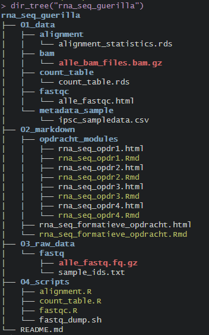
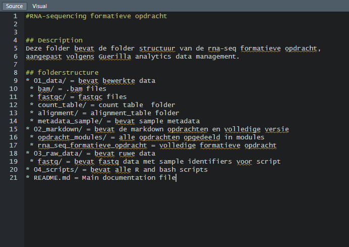
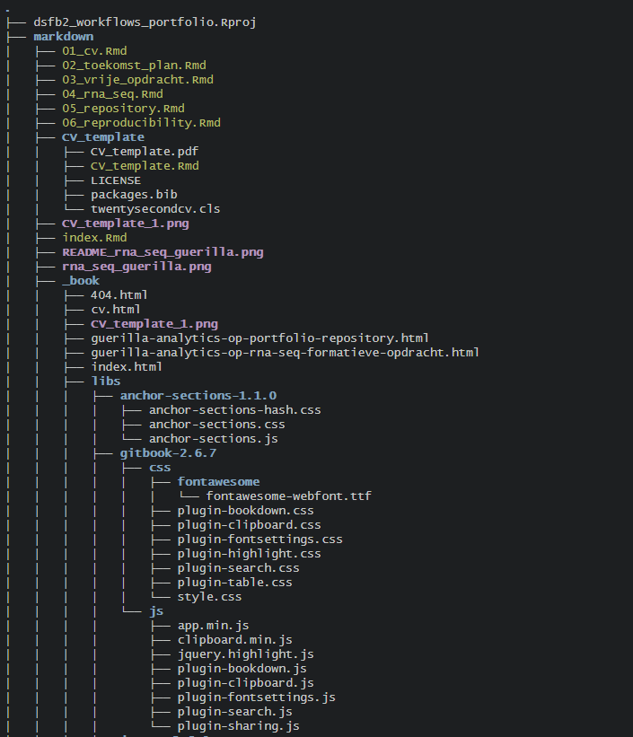
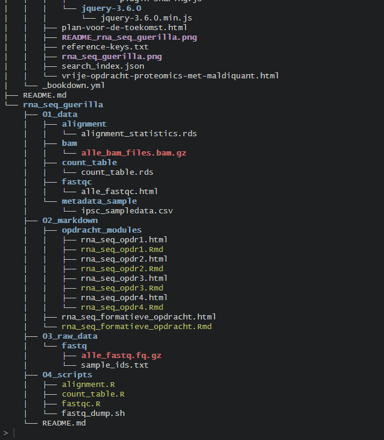
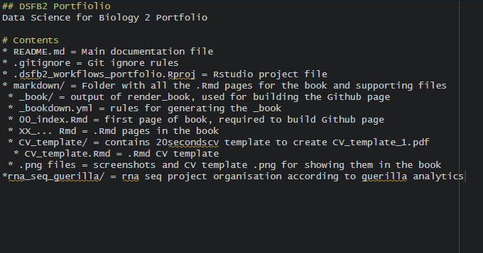

---
title: "DSFB2 Portfolio"
author: "Mathijs van Drongelen"
bibliography: "Projecticum.bib"
site: bookdown::bookdown_site
documentclass: book
output:
  bookdown::gitbook: default
  #bookdown::pdf_book: default
---

# Index 

<!--chapter:end:index.Rmd-->

# CV

```{r name, message=FALSE,include=FALSE}
library(pdftools)

pdf_convert("CV_template/CV_template.pdf", format = "png", pages = 1, dpi = 300)
```

{width=100%}


<!--chapter:end:01_cv.Rmd-->

# Plan voor de toekomst

In deze cursus leren we een vaardigheid in onze vrije ruimte, om te kiezen of hij relevant is voor mijn toekomst moet ik mezelf vragen: Wat wil ik in mijn toekomst? 


Hierover de volgende vragen:

* Waar zou je graag willen werken over 1 of 2 jaar? Hoe zie jouw droombaan er uit?

Ik heb nog weinig gedacht over een droombaan of waar ik mezelf over een paar jaar zie. Ik hoop op een plek te komen waarbij ik de skills die ik geleerd heb qua data analyse en management van de Data Science cursus kan benuttigen. Hierbij zou ik graag nog steeds nat labwerk willen doen. Of dit nou met cellen, eiwit of DNA is maakt mij niet uit. 


* Hoe sta je er nu voor om daadwerkelijk aan die droombaan te kunnen beginnen? Welke skills heb je al?

Ik sta er best netjes voor. Ik heb ervaring met alle standaard labtechnieken, lab automation ervaring van mijn BMR specialisatie en stage. Hieraan heb ik Data Science vaardigheden toegevoegd met betrekking tot R, Bash, Github en data management. 


* Welke skills zou je nog moeten/willen leren?

Ik zou graag willen verbeteren met bash scripting en het leren van Python. Ik zou ook verschillende analyses in Rstudio willen uitvoeren. Wat voorbeelden hiervan zijn: proteomics, massa spectrofotometrie en FACS. Hierbuiten wil ik beter worden in het automatiseren van de analyses met scripting en Rmarkdown. 


<!--chapter:end:02_toekomst_plan.Rmd-->


# Vrije opdracht proteomics

Placeholder


## Omschrijving
## Planning
### Bronnen

<!--chapter:end:03_vrije_opdracht.Rmd-->

# Guerilla analytics op rna-seq formatieve opdracht

Opdracht3a, screenshot met dir_tree van de rna_seq_guerilla folder en de README.md van de folder.

{width=100%}
{width=100%}


<!--chapter:end:04_rna_seq.Rmd-->

# Guerilla analytics op portfolio repository 

Portfolio repository folder structure screenshots met dir_tree en README.md screenshot.

{width=100%}
{width=100%}
{width=100%}

<!--chapter:end:05_repository.Rmd-->


# Reproduceerbaarheid 

Placeholder


## vervolgonderzoek

<!--chapter:end:06_reproducibility.Rmd-->


# 4b Artikel beoordeling 

Placeholder


## Samenvatting methode en resultaten
## Criteria 
## Code beoordeling

<!--chapter:end:07_reproduction2.Rmd-->


# Project Leptospira introductie

Dit project is gedeeltelijk vertrouwlijk, dus deze introductie zal gaan over de Leptospira bacterie waar wij mee te werk gaan. 

Leptospira is een bacterie, deze bacterie staat bekend als grote oorzak van zoönose.De ziekte komt vaak voor bij in tropische regio's met warm weer en slechte hygiëne. Leptsopira worden gekarakteriseerd door hun unieke vorm. De bacterien zijn dun, lang en spiraalvormig. Leptospira is erg bewegelijk is water en verspreid zijn besmetting via water. Het leptospira genoom is ~4.000.000 bp, bevat 2 tot 9 circulaire chromosomen. CI is het grote chromosoom van 3.6Mb waar de meeste genen zitten, CII is een kleiner genoom met overige essentiële genen. Er worden ook leptofagen en plasmiden gevonden in leptospira. De besmetting komt meestal voor door vervuiling van het water door besmette knaagdieren, maar huisdieren en vee kunnen ook besmet raken en direct mensen besmetten. Het grote probleem met leptospira en leptospirose is dat de grote meerderheid van patiënten naar het ziekenhuis moeten, in nederland werd 86% van de patiënten met leptospirose opgenomen in het ziekenhuis. (@costaGlobalMorbidityMortality2015; @obelsIncreasedIncidenceHuman2025; @johnsonLeptospira1996; @lehmannLeptospiralPathogenomics2014; @rajapakseLeptospirosis2025)


<!--chapter:end:08_bronvermelding.Rmd-->

---
title: "Parametrized COVID-19 data"
output: html_document
params:
  land: "France"
  jaar: "2020"
  maand: "12"
---

```{r setup, message=FALSE}
library(tidyverse)
```

```{r data acquisition, fig.width=13}
covid_data<-read.csv("https://opendata.ecdc.europa.eu/covid19/nationalcasedeath_eueea_daily_ei/csv/", na.strings = "", fileEncoding = "UTF-8-BOM")

covid_data$year<-as.factor(covid_data$year)

# Filtering gedaan i.v.m. negatieve case/deaths aantallen, aangenomen dat dit een typo was en '-' symbool verwijderd

covid_data$cases<-abs(covid_data$cases)
covid_data$deaths<-abs(covid_data$deaths)

covid_filtered<-covid_data %>% filter(countriesAndTerritories == params$land & year == params$jaar & month == params$maand)

case_plot<-covid_filtered %>% ggplot(aes(x = day,y = cases))+
  geom_col()+
  labs(title = paste0("Number of COVID-19 cases in ",params$land," in the month of ",params$jaar,"-",params$maand," per day"),
       x = "Days of the month",
       y = "Number of cases per day",subtitle = paste0("Data was taken from European Centre for Disease Prevention and Control (ECDC). 
Total number of cases in ",params$land," during this month: ",sum(covid_filtered$cases)))+
  theme_bw()

deaths_plot<-covid_filtered %>% ggplot(aes(x = day,y = deaths))+
  geom_col()+
  labs(title = paste0("Number of COVID-19 deaths in ",params$land," in the month of ",params$jaar,"-",params$maand," per day"), x = "Days of the month",
       y = "Number of deaths per day",subtitle = paste0("Data was taken from European Centre for Disease Prevention and Control (ECDC)
Total number of deaths in ",params$land," during this month: ",sum(covid_filtered$deaths)))+
  theme_bw()
```

De code voor het importeren, filteren en plotten van de COVID-19 data zit hierboven. De parameters zijn land, jaar en maand. Dit script werkt niet indien er een list van landen/maanden of jaren wordt toegevoegd. Dus "Netherlands","Belgium"zou niet werken.  


```{r, echo=FALSE}
case_plot
deaths_plot
```

Indien specifiek het totale aantal cases/deaths per maand nodig was staat de som voor het aantal cases en deaths staat erbij in de subtext. 

[Video van het gebruik van deze .Rmd](Portfolio_files/Parametrized_COVID_data recording.mp4)

<!--chapter:end:09_param.Rmd-->

